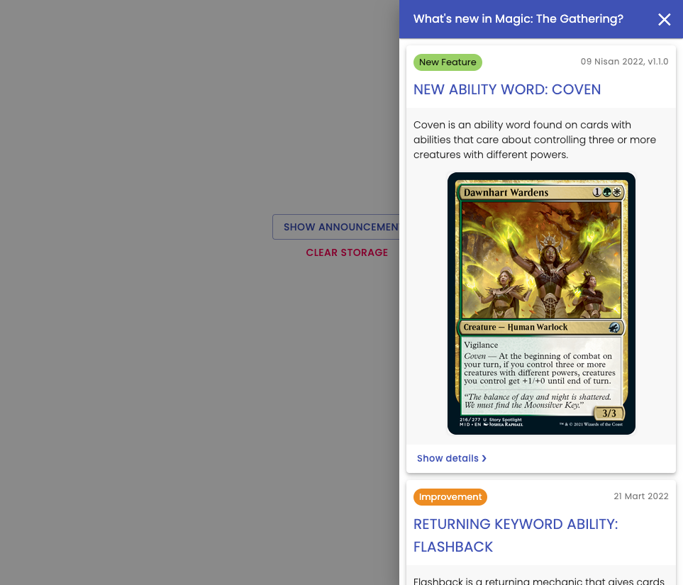
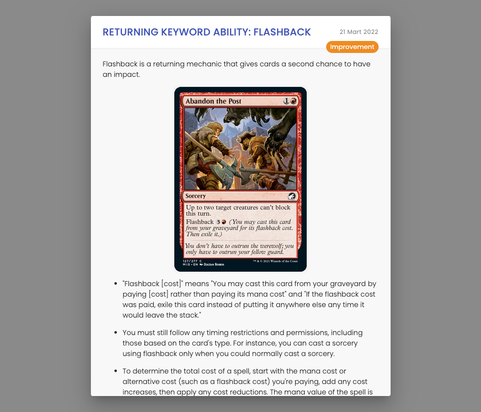

# What's New component for react

> Show new features

[](https://GitHub.com/paraboly/react-apexcharts-dynamic-config/graphs/commit-activity)
[](https://www.npmjs.com/package/@schemesonic/whats-new) [](https://app.netlify.com/sites/react-whats-new/deploys)
[](https://github.com/Naereen/StrapDown.js/blob/master/LICENSE)

## Demo

| Announcements                                                                |                              Announcement Details                               |
| ---------------------------------------------------------------------------- | :-----------------------------------------------------------------------------: |
|  |  |

> https://react-whats-new.netlify.app

---

## Install

```bash
npm install --save @paraboly/react-apexcharts-dynamic-config
```

---

## Usage

```tsx
import React from 'react';
import ReactNpmStarter from '@schemesonic/react-npm-starter';

const example = (): JSX.Element => {
  const options = { someProps: [] };

  return <ReactNpmStarter prop={options} onChange={opt => console.log(opt)} />;
};

export default example;
```

## Details

| Props    |        Definition         |                         Type | Default | Required |
| -------- | :-----------------------: | ---------------------------: | ------: | -------: |
| prop     |       Example prop        |                       `Prop` |    null |     true |
| onChange | Example callback function | `(updatedOpt: Prop) => void` |    null |     true |

---

## Licence

[MIT](./LICENSE) License © [SchemeSonic](https://github.com/jaredpalmer/tsdx)
